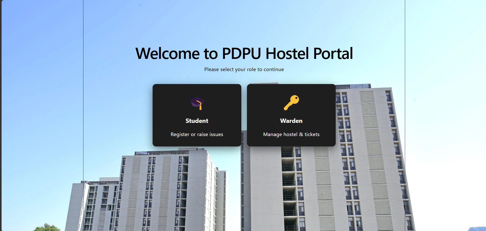
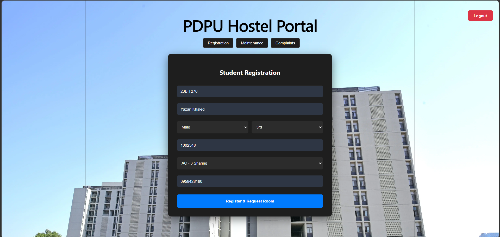
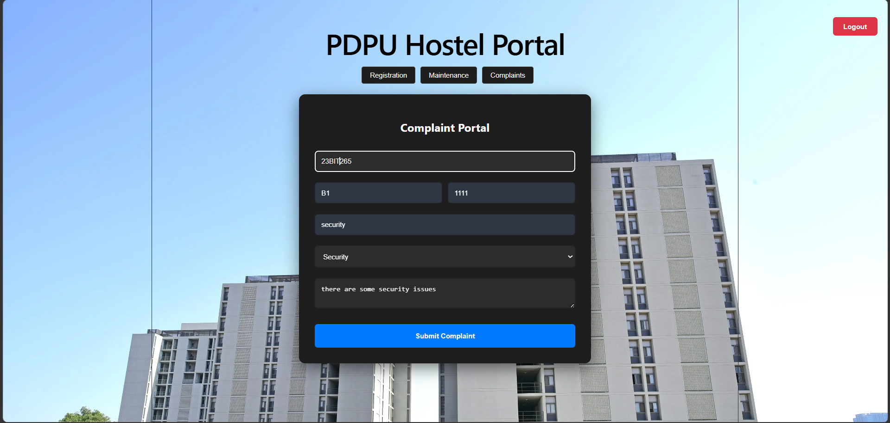
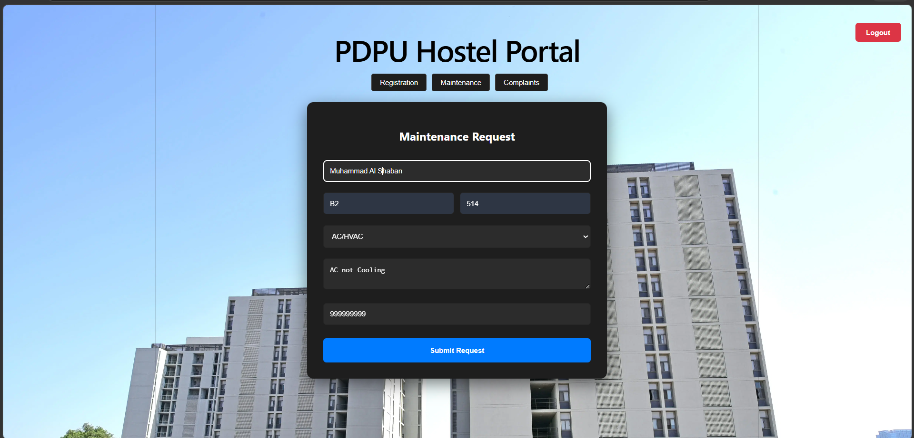
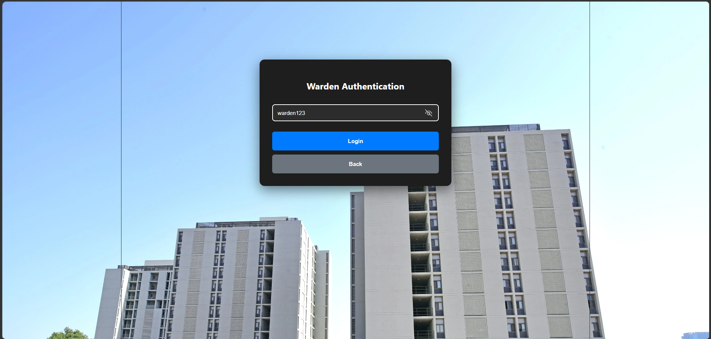
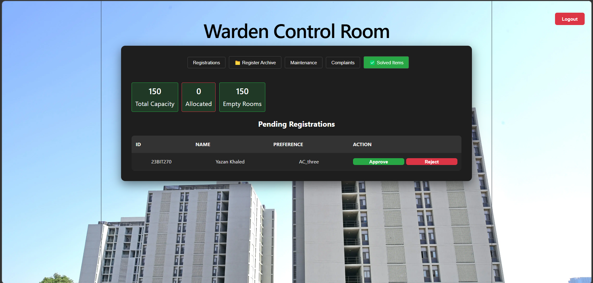
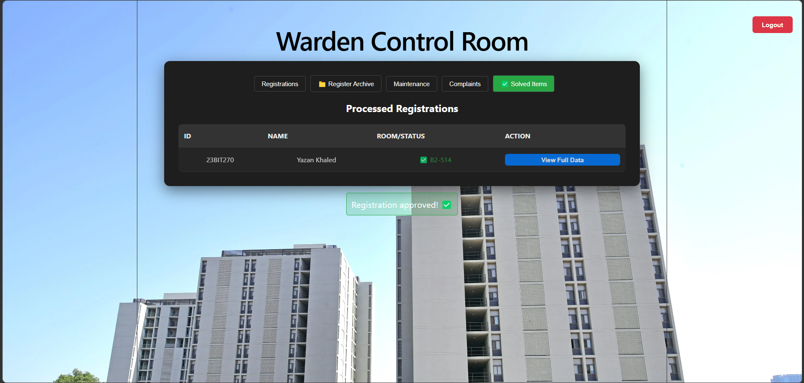
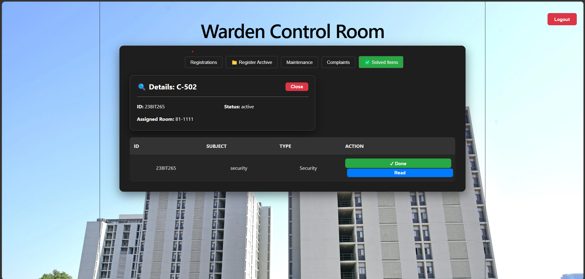
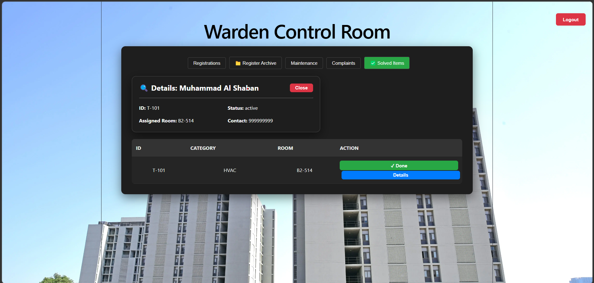

# 🏢 Hostel Management Portal (Full Stack Web Application)

A full-stack hostel management system built using **Flask** and **React.js** that simulates real-world hostel operations including room allocation, maintenance tracking, and complaint handling.

---

## 🚀 Features

### 👨‍🎓 Student

* Register for hostel rooms
* Select preferences
* Submit maintenance requests
* Raise complaints

### 🛠 Warden/Admin

* Approve / Reject registrations
* Assign rooms (Block & Room)
* Track occupancy
* Manage maintenance & complaints
* View solved items

---

## 🧠 System Highlights

* Role-based system (Student / Warden)
* Ticket lifecycle management
* Centralized admin dashboard
* Real-time updates using REST APIs

---

## 🏗️ Tech Stack

* **Frontend:** React (Vite), CSS
* **Backend:** Flask (Python)
* **Communication:** REST API

---

## 📸 Screenshots

### 🔹 Landing Page



---

### 🔹 Student Registration



---

### 🔹 Complaint Portal



---

### 🔹 Maintenance Request



---

### 🔹 Warden Login



---

### 🔹 Dashboard Overview



---

### 🔹 Registration Archive



---

### 🔹 Complaints & Maintenance History


---

### 🔹 Complaint Handling



---

### 🔹 Maintenance Management



---

## 📡 API Endpoints

| Endpoint                      | Method | Description          |
| ----------------------------- | ------ | -------------------- |
| `/register`                   | POST   | Student registration |
| `/registration_decision/<id>` | POST   | Approve / Reject     |
| `/maintenance`                | POST   | Maintenance request  |
| `/complaint`                  | POST   | Complaint            |
| `/get_tickets`                | GET    | Get all data         |
| `/update_ticket/<id>`         | POST   | Update status        |

---

## ▶️ How to Run

### Backend

```
cd backend
pip install flask flask-cors
python App.py
```

### Frontend

```
cd frontend
npm install
npm run dev
```

---

## ⚠️ Notes

* Uses in-memory database (data resets on restart)
* Demo authentication (not production-ready)

---

## 👥 Contributors

* **Yazan Khaled**
* **@username**

---

## ⭐ Purpose

This project demonstrates a **full-stack system with real-world workflow simulation**, including role management, ticket processing, and admin dashboards.
